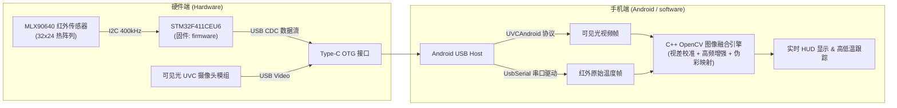

# ThermalEyes (双目手机红外热成像系统)

<div align="center">


**一款集可见光与远红外热辐射于一体的双光谱手机热成像开源套件**  
*支持实时双光图像融合、视差校准补偿、伪彩映射与高低温动态跟踪*

</div>

---

## 📖 项目简介 (Overview)

**ThermalEyes** 是一个软硬件结合的全栈开源项目。项目通过外接便携式双目模组（可见光摄像头 + MLX90640 远红外传感器），在 Android 移动端实现双光融合成像。借助 C++ (OpenCV) 原生算法，将可见光的丰富高频细节与红外热辐射轮廓实时叠加，解决红外分辨率低、轮廓模糊的问题。

本项目采用 **Monorepo（单一大仓库）** 结构，包含**下位机固件**、**Android 客户端应用**以及**3D 打印外壳模型**。

---

## 🗂️ 仓库目录结构 (Repository Structure)

```text
ThermalEyes/
├── software/                 # Android 手机客户端源码
│   ├── app/                  # 主 APP 模块 (Java UI + NDK C++ 融合算法)
│   ├── OpenCV/               # OpenCV Android SDK 模块
│   └── build.gradle          # Gradle 构建配置
│
├── firmware/                 # STM32 下位机桥接固件源码
│   ├── Core/                 # STM32 主逻辑与系统配置
│   ├── Hardware/             # MLX90640 I2C 驱动与温度解析算法
│   ├── USB_DEVICE/           # USB CDC 虚拟串口通讯协议
│   └── thermal_bridge.ioc    # STM32CubeMX 工程配置文件
│
├── hardware/                 # 硬件外壳结构设计
│   ├── *.STL                 # 3D 打印成型切片模型 (顶盖与底座)
│   └── *.STEP                # CAD 三维结构工程源文件
│
├── .gitignore                # 统合过滤编译输出与环境配置
└── README.md                 # 项目说明文档
```

---

## 🛠️ 系统架构与数据链路 (System Architecture)



---

## 📋 硬件物料清单 (Hardware BOM)

| 部件类别 | 型号 / 规格 | 说明 |
| :--- | :--- | :--- |
| **主控芯片** | STM32F411CEU6 (BlackPill 或定制板) | 运行 `firmware/` 固件，解析 MLX90640 并通过 USB CDC 上传 |
| **红外热传感器** | MLX90640 (常用 55° 或 110° 视场角) | 32×24 像素阵列远红外传感器，I2C 通讯 |
| **可见光相机** | UVC 协议免驱 USB 摄像头模组 | 与红外传感器等间距并排安装 |
| **连接外壳** | 3D 打印外壳 (`hardware/` 目录) | 建议使用 PETG 或树脂 3D 打印，双镜头固定 |
| **通讯接口** | Type-C 数据线 / OTG 转换器 | 连接至 Android 手机 USB-C 口 |

---

## 🚀 快速上手与复刻指南 (Getting Started)

### 1. 固件烧录 (`firmware/`)
- **开发工具**：STM32CubeIDE (推荐 v1.13.0+)
- **烧录接口**：采用 **SH1.0 4-Pin SWD 接口**，线序如下（供电 3.3V）：
  ```text
  | GND | SWDIO | SWCLK | 3.3V |
  ```
- **编译与烧录**：
  1. 使用 STM32CubeIDE 打开 `firmware/` 目录作为工程。
  2. 连接 ST-Link 或 DAP-Link 调试器。
  3. 执行 `Project -> Build Project`，点击 Run/Debug 将固件烧录进 STM32。

### 2. Android 客户端构建 (`software/`)
- **开发工具**：Android Studio (推荐 Bumblebee 或更新版本)
- **依赖环境**：Android SDK、NDK (Side-by-side)、CMake
- **构建步骤**：
  1. 使用 Android Studio 打开 `software/` 目录。
  2. 等待 Gradle 同步完成（若提示 NDK/CMake 缺失请根据提示在 SDK Manager 中安装）。
  3. 连接支持 OTG 功能的 Android 手机，开启开发者选项与 USB 调试。
  4. 点击 **Run 'app'** 安装至手机。

### 3. 外壳制作 (`hardware/`)
- 使用 3D 打印切片软件（如 Cura、Bambu Studio、PrusaSlicer）导入 `hardware/` 目录下的 `.STL` 文件：
  - `binocular_thermal_imager - bottom-2.STL`（下盖）
  - `binocular_thermal_imager - top-2.STL`（上盖）
- **打印建议**：层高 0.16mm - 0.2mm，填充率 30% 以上。

---

## ✨ 核心功能与使用特性 (Features)

1. **双光谱实时融合**：
   - 采用拉普拉斯/高斯滤波提取可见光高频轮廓，与热分布底图融合，实现细节丰富的高清热成像。
2. **多模式切换**：
   - 支持纯可见光、纯红外热成像、轮廓画中画、双光叠加融合模式。
3. **视差动态校准 (Parallax Correction)**：
   - 算法内置水平与垂直平移补偿调节，消除不同测距下双镜头物理间距造成的图像重影。
4. **多样化伪彩映射 (Colormaps)**：
   - 支持 Ironbow（铁红）、Rainbow（彩虹）、JET、White Hot、Black Hot 等主流热成像调色板。
5. **动态高低温标记**：
   - 实时自动检测全屏最高温、最低温坐标，并自动跟随绘制十字准星与数值。

---

## 📄 许可证 (License)

本项目基于 [MIT License](software/LICENSE) 开源。欢迎 Star、Fork 并提交 Pull Request！
